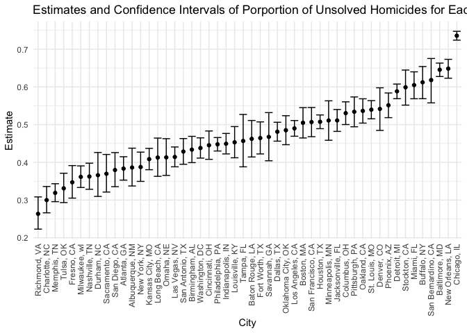
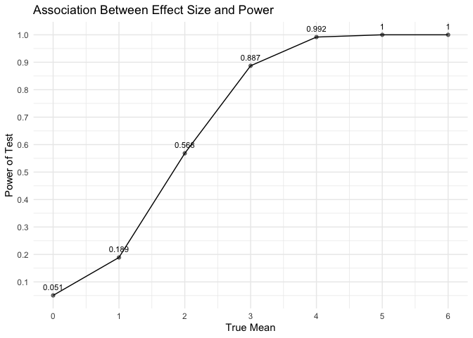
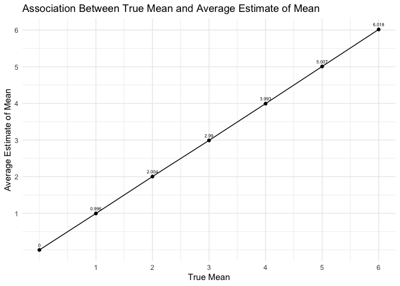
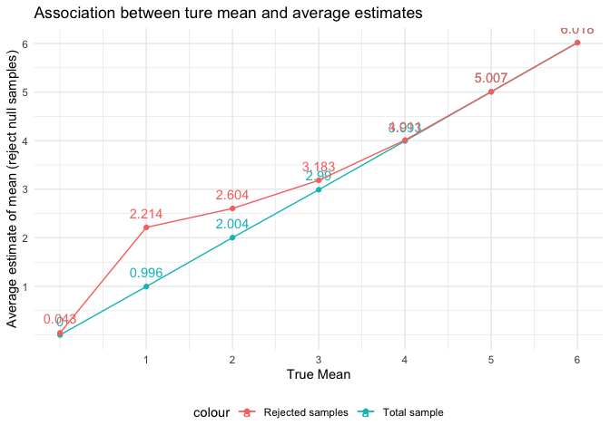

p8105_hw5_fx2184
================
Fei
2022-11-15

# Problem 1

First import the data in individual spreadsheets contained in
`./data/zip_data/`. A dataframe is created that includes the list of all
files in that directory and the complete path to each file. Next, `map`
over paths and import data using the `read_csv` function. Finally,
`unnest` the result of `map`.

``` r
full_df = 
  tibble(
    files = list.files("./data/"),
    path = str_c("./data/", files)
  ) %>% 
  mutate(data = map(path, read_csv)) %>% 
  unnest()
```

``` r
# Tidy the data
tidy_df = 
  full_df %>% 
  mutate(
    files = str_replace(files, ".csv", ""),
    group = str_sub(files, 1, 3)) %>% 
  pivot_longer(
    week_1:week_8,
    names_to = "week",
    values_to = "outcome",
    names_prefix = "week_") %>% 
  mutate(week = as.numeric(week)) %>% 
  select(group, subj = files, week, outcome)
```

``` r
# Make a spaghetti plot showing observations on each subject over time
tidy_df %>% 
  ggplot(aes(x = week, y = outcome, color = group)) + 
  geom_point() + 
  geom_path() + 
  facet_grid(~group) + 
  labs(x = "Week", y = "Outcome", 
       title = "Observations on Each Subject over 8 Weeks in Two Groups")
```

<!-- -->

# Problem 2

``` r
# read the data from the web 
url = "https://raw.githubusercontent.com/washingtonpost/data-homicides/master/homicide-data.csv"

homicides_raw = read_csv(url)
```

    ## Rows: 52179 Columns: 12
    ## ── Column specification ────────────────────────────────────────────────────────
    ## Delimiter: ","
    ## chr (9): uid, victim_last, victim_first, victim_race, victim_age, victim_sex...
    ## dbl (3): reported_date, lat, lon
    ## 
    ## ℹ Use `spec()` to retrieve the full column specification for this data.
    ## ℹ Specify the column types or set `show_col_types = FALSE` to quiet this message.

-   The raw dataset include 52179observations of homicides reported
    criminal homicides over the past decade in 50 of the largest
    American cities, and 12 key variables, they are uid, reported_date,
    victim_last, victim_first, victim_race, victim_age, victim_sex,
    city, state, lat, lon, disposition.
-   some reported `unknown` under variable victim age, sex and race.
-   the `lat` contains 60 missing value, and `lon` contains 60 missing
    value,
-   the raw data contains 3 numeric variables: reported data. longitude
    and latitude, rest of the variables are designed as character
    variables.
-   The data contains only one observation from `Tulsa` with state `OK`,
    which does not make sense. So I assume it’s a typo, I will delete
    this row in the further cleaning step.

## clean the raw data and create city_state and resolved

``` r
homicides = homicides_raw %>% 
  janitor::clean_names() %>% 
  mutate(city_state = str_c(city, state,sep = ", "),
         resolved = case_when(
           disposition == "Closed by arrest" ~ "solved",
           disposition ==  "Open/No arrest" ~ "unsolved",
           disposition ==  "Closed without arrest" ~ "unsolved"
         )) %>% 
  filter(city_state != "Tulsa, AL") %>% 
  relocate(uid, city_state)
```

``` r
#summarize within cities to obtain the total number of homicides and the number of unsolved homicides
total_homicides = homicides %>% 
  group_by(city_state) %>% 
  summarize(total_homicide = n(), unsolved = sum(resolved == "unsolved")) 

total_homicides %>% knitr::kable(align='c',col.names = c("City/State","Total Number of Homicids","Number of Unsolved "))
```

|     City/State     | Total Number of Homicids | Number of Unsolved |
|:------------------:|:------------------------:|:------------------:|
|  Albuquerque, NM   |           378            |        146         |
|    Atlanta, GA     |           973            |        373         |
|   Baltimore, MD    |           2827           |        1825        |
|  Baton Rouge, LA   |           424            |        196         |
|   Birmingham, AL   |           800            |        347         |
|     Boston, MA     |           614            |        310         |
|    Buffalo, NY     |           521            |        319         |
|   Charlotte, NC    |           687            |        206         |
|    Chicago, IL     |           5535           |        4073        |
|   Cincinnati, OH   |           694            |        309         |
|    Columbus, OH    |           1084           |        575         |
|     Dallas, TX     |           1567           |        754         |
|     Denver, CO     |           312            |        169         |
|    Detroit, MI     |           2519           |        1482        |
|     Durham, NC     |           276            |        101         |
|   Fort Worth, TX   |           549            |        255         |
|     Fresno, CA     |           487            |        169         |
|    Houston, TX     |           2942           |        1493        |
|  Indianapolis, IN  |           1322           |        594         |
|  Jacksonville, FL  |           1168           |        597         |
|  Kansas City, MO   |           1190           |        486         |
|   Las Vegas, NV    |           1381           |        572         |
|   Long Beach, CA   |           378            |        156         |
|  Los Angeles, CA   |           2257           |        1106        |
|   Louisville, KY   |           576            |        261         |
|    Memphis, TN     |           1514           |        483         |
|     Miami, FL      |           744            |        450         |
|   Milwaukee, wI    |           1115           |        403         |
|  Minneapolis, MN   |           366            |        187         |
|   Nashville, TN    |           767            |        278         |
|  New Orleans, LA   |           1434           |        930         |
|    New York, NY    |           627            |        243         |
|    Oakland, CA     |           947            |        508         |
| Oklahoma City, OK  |           672            |        326         |
|     Omaha, NE      |           409            |        169         |
|  Philadelphia, PA  |           3037           |        1360        |
|    Phoenix, AZ     |           914            |        504         |
|   Pittsburgh, PA   |           631            |        337         |
|    Richmond, VA    |           429            |        113         |
|   Sacramento, CA   |           376            |        139         |
|  San Antonio, TX   |           833            |        357         |
| San Bernardino, CA |           275            |        170         |
|   San Diego, CA    |           461            |        175         |
| San Francisco, CA  |           663            |        336         |
|    Savannah, GA    |           246            |        115         |
|   St. Louis, MO    |           1677           |        905         |
|    Stockton, CA    |           444            |        266         |
|     Tampa, FL      |           208            |         95         |
|     Tulsa, OK      |           583            |        193         |
|   Washington, DC   |           1345           |        589         |

``` r
# For the city of Baltimore, MD,estimate the proportion of homicides that are unsolved
prop_baltimore =  prop.test(total_homicides %>% filter(city_state == "Baltimore, MD") %>% pull(unsolved),
                            total_homicides %>% filter(city_state == "Baltimore, MD") %>% pull(total_homicide))
broom::tidy(prop_baltimore)[,c(1,5,6)] 
```

    ## # A tibble: 1 × 3
    ##   estimate conf.low conf.high
    ##      <dbl>    <dbl>     <dbl>
    ## 1    0.646    0.628     0.663

The estimate proportion of unsolved homicides in Baltimore, MD is
0.6455607 with confidence interval

``` r
# Estimate proportion of homicides that are unsolved for each of the cities 
# extract both the proportion of unsolved homicides and the confidence interval for each.
prop_cities = 
  total_homicides %>% 
  mutate(prop_test = purrr::map2(.x = unsolved, .y = total_homicide, ~prop.test(x = .x, n = .y)),
         tidy_test = purrr::map(.x = prop_test, ~broom::tidy(.x))) %>% 
  unnest(tidy_test) %>% 
  select(city_state, estimate, conf.low, conf.high)

prop_cities%>% knitr::kable(align='c',col.names = c("City/State","Estimate","Confidence(lower)","Confidence(upper)"))
```

|     City/State     | Estimate  | Confidence(lower) | Confidence(upper) |
|:------------------:|:---------:|:-----------------:|:-----------------:|
|  Albuquerque, NM   | 0.3862434 |     0.3372604     |     0.4375766     |
|    Atlanta, GA     | 0.3833505 |     0.3528119     |     0.4148219     |
|   Baltimore, MD    | 0.6455607 |     0.6275625     |     0.6631599     |
|  Baton Rouge, LA   | 0.4622642 |     0.4141987     |     0.5110240     |
|   Birmingham, AL   | 0.4337500 |     0.3991889     |     0.4689557     |
|     Boston, MA     | 0.5048860 |     0.4646219     |     0.5450881     |
|    Buffalo, NY     | 0.6122841 |     0.5687990     |     0.6540879     |
|   Charlotte, NC    | 0.2998544 |     0.2660820     |     0.3358999     |
|    Chicago, IL     | 0.7358627 |     0.7239959     |     0.7473998     |
|   Cincinnati, OH   | 0.4452450 |     0.4079606     |     0.4831439     |
|    Columbus, OH    | 0.5304428 |     0.5002167     |     0.5604506     |
|     Dallas, TX     | 0.4811742 |     0.4561942     |     0.5062475     |
|     Denver, CO     | 0.5416667 |     0.4846098     |     0.5976807     |
|    Detroit, MI     | 0.5883287 |     0.5687903     |     0.6075953     |
|     Durham, NC     | 0.3659420 |     0.3095874     |     0.4260936     |
|   Fort Worth, TX   | 0.4644809 |     0.4222542     |     0.5072119     |
|     Fresno, CA     | 0.3470226 |     0.3051013     |     0.3913963     |
|    Houston, TX     | 0.5074779 |     0.4892447     |     0.5256914     |
|  Indianapolis, IN  | 0.4493192 |     0.4223156     |     0.4766207     |
|  Jacksonville, FL  | 0.5111301 |     0.4820460     |     0.5401402     |
|  Kansas City, MO   | 0.4084034 |     0.3803996     |     0.4370054     |
|   Las Vegas, NV    | 0.4141926 |     0.3881284     |     0.4407395     |
|   Long Beach, CA   | 0.4126984 |     0.3629026     |     0.4642973     |
|  Los Angeles, CA   | 0.4900310 |     0.4692208     |     0.5108754     |
|   Louisville, KY   | 0.4531250 |     0.4120609     |     0.4948235     |
|    Memphis, TN     | 0.3190225 |     0.2957047     |     0.3432691     |
|     Miami, FL      | 0.6048387 |     0.5685783     |     0.6400015     |
|   Milwaukee, wI    | 0.3614350 |     0.3333172     |     0.3905194     |
|  Minneapolis, MN   | 0.5109290 |     0.4585150     |     0.5631099     |
|   Nashville, TN    | 0.3624511 |     0.3285592     |     0.3977401     |
|  New Orleans, LA   | 0.6485356 |     0.6231048     |     0.6731615     |
|    New York, NY    | 0.3875598 |     0.3494421     |     0.4270755     |
|    Oakland, CA     | 0.5364308 |     0.5040588     |     0.5685037     |
| Oklahoma City, OK  | 0.4851190 |     0.4467861     |     0.5236245     |
|     Omaha, NE      | 0.4132029 |     0.3653146     |     0.4627477     |
|  Philadelphia, PA  | 0.4478103 |     0.4300380     |     0.4657157     |
|    Phoenix, AZ     | 0.5514223 |     0.5184825     |     0.5839244     |
|   Pittsburgh, PA   | 0.5340729 |     0.4942706     |     0.5734545     |
|    Richmond, VA    | 0.2634033 |     0.2228571     |     0.3082658     |
|   Sacramento, CA   | 0.3696809 |     0.3211559     |     0.4209131     |
|  San Antonio, TX   | 0.4285714 |     0.3947772     |     0.4630331     |
| San Bernardino, CA | 0.6181818 |     0.5576628     |     0.6753422     |
|   San Diego, CA    | 0.3796095 |     0.3354259     |     0.4258315     |
| San Francisco, CA  | 0.5067873 |     0.4680516     |     0.5454433     |
|    Savannah, GA    | 0.4674797 |     0.4041252     |     0.5318665     |
|   St. Louis, MO    | 0.5396541 |     0.5154369     |     0.5636879     |
|    Stockton, CA    | 0.5990991 |     0.5517145     |     0.6447418     |
|     Tampa, FL      | 0.4567308 |     0.3881009     |     0.5269851     |
|     Tulsa, OK      | 0.3310463 |     0.2932349     |     0.3711192     |
|   Washington, DC   | 0.4379182 |     0.4112495     |     0.4649455     |

## create a plot showing the estimates and CI

``` r
prop_cities%>%
  mutate(city_state = fct_reorder(city_state, estimate)) %>%
  ggplot(aes(x = city_state, y = estimate)) +
  geom_point() +
  geom_errorbar(aes(ymin = conf.low, ymax = conf.high)) +
  labs(x = "City",
       y = "Estimate",
       title = "Estimates and Confidence Intervals of Porportion of Unsolved Homicides for Each City") +
  theme(axis.text.x = element_text(angle = 90, vjust = 0.5, hjust=1))
```

<!-- --> \#
Problem 3: Explore power in a one-sample t-test.

``` r
set.seed(1)
```

## generate the function

``` r
ttest = function(n = 30, mu, sigma = 5) {

  sim_data = tibble(
    x = rnorm(n, mean = mu, sd = sigma),
  )
  
  test_data =  t.test(sim_data, mu = 0, conf.level = 0.95) 
  
  sim_data %>% 
    summarize(
      mu_hat = pull(broom::tidy(test_data), estimate),
      p_value = pull(broom::tidy(test_data), p.value)
    )
}
```

## generate 5000 datasets from the model $X \sim Normal[\mu, \sigma]$

``` r
set.seed(1)

sim_result = tibble(mu = c(0:6)) %>% 
              mutate(
                output_list = map(.x = mu, ~rerun(5000,ttest(mu=.x))),
                estimate_df = map(output_list, bind_rows)
              ) %>% 
    select(-output_list) %>% 
    unnest(estimate_df)
```

``` r
#showing the proportion of times the null was rejected (the power of the test) on the y axis and the true value of μ
#on the x axis. Describe the association between effect size and power.
sim_result %>% 
  group_by(mu) %>% 
  summarize(rej_num = sum(p_value <0.05),
            total = n(),
            rej_prop = rej_num/total) %>% 
  ggplot(aes(x=mu, y = rej_prop))+
  geom_point(alpha = 0.5)+
  geom_line()+
  geom_text(aes(label = round(rej_prop,3)), vjust = -1, size = 3)+
  labs(
    title = "Association Between Effect Size and Power",
    x = "True Mean", y = "Power of Test"
  )+
  scale_x_continuous(n.breaks = 6)+
  scale_y_continuous(n.breaks = 10)
```

<!-- -->

``` r
#Make a plot showing the average estimate of μ̂， on the y axis and the true value of μ，  on the x axis. 
sim_result %>% 
  group_by(mu)%>% 
  summarize(average_mu = mean(mu_hat)) %>% 
  ggplot(aes(x = mu, y=average_mu))+
  geom_point()+
  geom_line()+
  geom_text(aes(label = round(average_mu,3)),vjust = -1, size = 2)+
  scale_x_continuous(breaks = 1:6)+ 
  scale_y_continuous(breaks = 1:6)+
  labs(
    title = "Association Between True Mean and Average Estimate of Mean",
    x = "True Mean",
    y = "Average Estimate of Mean"
  )
```

<!-- -->

``` r
#Make a second plot showing the average estimate of μ_hat only in samples for which the null was rejected on the y axis and the true value of μ on the x axis
sim_reject = sim_result %>% 
  group_by(mu)%>% 
  filter(p_value<0.05) %>%
  summarize(average_mu = mean(mu_hat))

sim_result%>% 
  group_by(mu)%>%
  summarize(average_mu = mean(mu_hat)) %>% 
  ggplot(aes(x=mu, y= average_mu, color = "Total sample"))+
  geom_point()+
  geom_line()+
  geom_text(aes(label = round(average_mu,3)),vjust = -1)+
  geom_point(data = sim_reject, aes(x= mu, y = average_mu, color = "Rejected samples"))+
  geom_line(data = sim_reject, aes(x= mu, y= average_mu, color = "Rejected samples"))+
  geom_text(data = sim_reject, aes(label = round(average_mu, 3), color = "Rejected samples"), vjust = -1)+
  scale_x_continuous(breaks = 1:6) +
  scale_y_continuous(breaks = 1:6) +
  labs(
    title = "Association between ture mean and average estimates",
    x= "True Mean",
    y= "Average estimate of mean (reject null samples)"
  )
```

<!-- -->
